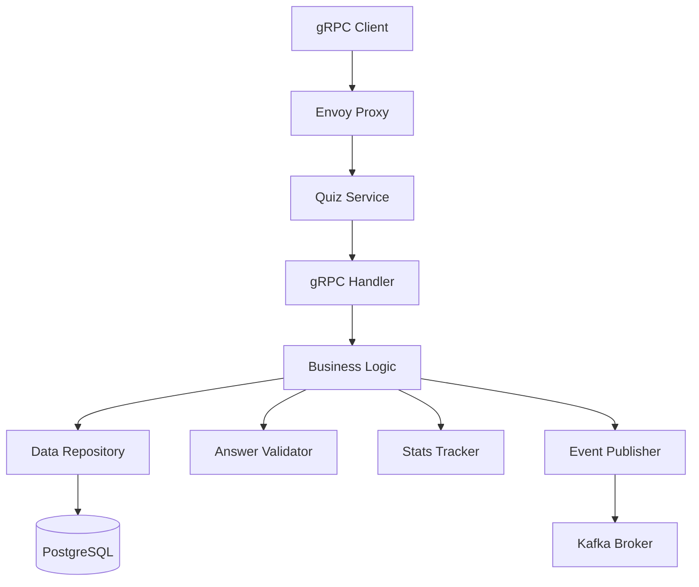

# 퀴즈 백엔드 서비스 설계 문서

## Overview

퀴즈 백엔드 서비스는 딥페이크 탐지 교육을 위한 인터랙티브 퀴즈 시스템을 제공하는 gRPC 기반 마이크로서비스입니다. 이 서비스는 4가지 질문 타입(객관식, OX, 영역선택, 비교)을 지원하며, 사용자 답변 검증, 통계 추적, 보상 계산, 이벤트 발행 기능을 제공합니다.

### 핵심 기능

- **질문 관리**: 4가지 타입의 퀴즈 질문 조회 (랜덤 또는 ID 기반)
- **답변 검증**: 각 질문 타입에 맞는 답변 검증 로직
- **통계 추적**: 사용자별 정답률, 연속 정답, 생명 관리
- **보상 시스템**: 정답 시 XP와 코인 부여
- **이벤트 발행**: Kafka를 통한 퀴즈 이벤트 발행

### 기술 스택

- **언어**: Go 1.21+
- **프로토콜**: gRPC (Protocol Buffers)
- **데이터베이스**: PostgreSQL 15+
- **메시지 브로커**: Apache Kafka
- **컨테이너화**: Docker, Docker Compose

## Architecture

### 시스템 아키텍처



### 레이어 구조

서비스는 다음과 같은 레이어로 구성됩니다:

1. **Handler Layer** (`internal/handler`): gRPC 요청/응답 처리
2. **Service Layer** (`internal/service`): 비즈니스 로직 구현
3. **Repository Layer** (`internal/repository`): 데이터베이스 접근
4. **Infrastructure Layer** (`pkg`): Kafka, 로깅 등 인프라 컴포넌트

### 디렉토리 구조

```
backend/services/quiz/
├── main.go                    # 서비스 진입점
├── Dockerfile                 # 컨테이너 이미지 정의
├── go.mod                     # Go 모듈 정의
├── proto/                     # 생성된 protobuf 코드
│   ├── quiz.pb.go
│   └── quiz_grpc.pb.go
├── internal/
│   ├── handler/              # gRPC 핸들러
│   │   └── quiz_handler.go
│   ├── service/              # 비즈니스 로직
│   │   ├── quiz_service.go
│   │   ├── validator.go
│   │   └── stats_tracker.go
│   └── repository/           # 데이터 접근
│       └── quiz_repository.go
└── pkg/
    └── kafka/                # Kafka 프로듀서
        └── producer.go
```

## Components and Interfaces

### 1. gRPC Handler

**책임**: gRPC 요청을 받아 서비스 레이어로 전달하고 응답을 반환합니다.

**인터페이스**:
```go
type QuizHandler struct {
    service QuizService
}

func (h *QuizHandler) GetRandomQuestion(ctx context.Context, req *pb.GetRandomQuestionRequest) (*pb.QuizQuestion, error)
func (h *QuizHandler) GetQuestionById(ctx context.Context, req *pb.GetQuestionByIdRequest) (*pb.QuizQuestion, error)
func (h *QuizHandler) SubmitAnswer(ctx context.Context, req *pb.SubmitAnswerRequest) (*pb.SubmitAnswerResponse, error)
func (h *QuizHandler) GetUserStats(ctx context.Context, req *pb.GetUserStatsRequest) (*pb.QuizStats, error)
```

### 2. Quiz Service

**책임**: 퀴즈 관련 비즈니스 로직을 처리합니다.

**인터페이스**:
```go
type QuizService interface {
    GetRandomQuestion(ctx context.Context, userID string, difficulty *string, questionType *pb.QuestionType) (*Question, error)
    GetQuestionById(ctx context.Context, questionID string) (*Question, error)
    SubmitAnswer(ctx context.Context, userID string, questionID string, answer Answer) (*SubmitResult, error)
    GetUserStats(ctx context.Context, userID string) (*UserStats, error)
}
```

**주요 메서드**:
- `GetRandomQuestion`: 필터 조건에 맞는 랜덤 질문 조회
- `GetQuestionById`: ID로 특정 질문 조회
- `SubmitAnswer`: 답변 검증, 통계 업데이트, 이벤트 발행
- `GetUserStats`: 사용자 통계 조회

### 3. Answer Validator

**책임**: 질문 타입별 답변 검증 로직을 제공합니다.

**인터페이스**:
```go
type AnswerValidator interface {
    ValidateMultipleChoice(selectedIndex int32, correctIndex int32, optionsCount int) (bool, error)
    ValidateTrueFalse(selectedAnswer bool, correctAnswer bool) bool
    ValidateRegionSelect(selectedPoint Point, correctRegions []Region, tolerance int32) bool
    ValidateComparison(selectedSide string, correctSide string) (bool, error)
}
```

**검증 로직**:
- **객관식**: 선택한 인덱스가 정답 인덱스와 일치하는지 확인
- **OX**: 선택한 답변이 정답과 일치하는지 확인
- **영역선택**: 선택한 좌표가 정답 영역 내에 있는지 유클리드 거리로 계산
- **비교**: 선택한 측면(left/right)이 정답과 일치하는지 확인

### 4. Stats Tracker

**책임**: 사용자 통계를 업데이트합니다.

**인터페이스**:
```go
type StatsTracker interface {
    UpdateStats(ctx context.Context, userID string, isCorrect bool) (*UserStats, error)
    GetStats(ctx context.Context, userID string) (*UserStats, error)
}
```

**업데이트 로직**:
- 총 답변 수 증가
- 정답 시: 정답 수 증가, 연속 정답 증가
- 오답 시: 연속 정답 초기화, 생명 감소
- 최고 연속 정답 갱신 (필요 시)
- 정답률 재계산

### 5. Quiz Repository

**책임**: 데이터베이스 CRUD 작업을 처리합니다.

**인터페이스**:
```go
type QuizRepository interface {
    GetRandomQuestion(ctx context.Context, difficulty *string, questionType *pb.QuestionType) (*Question, error)
    GetQuestionById(ctx context.Context, questionID string) (*Question, error)
    SaveAnswer(ctx context.Context, answer *UserAnswer) error
    GetUserStats(ctx context.Context, userID string) (*UserStats, error)
    UpdateUserStats(ctx context.Context, stats *UserStats) error
    CreateUserStats(ctx context.Context, userID string) (*UserStats, error)
}
```

### 6. Event Publisher

**책임**: Kafka를 통해 퀴즈 이벤트를 발행합니다.

**인터페이스**:
```go
type EventPublisher interface {
    PublishQuizAnswered(ctx context.Context, event *QuizAnsweredEvent) error
}

type QuizAnsweredEvent struct {
    UserID       string
    QuestionID   string
    Correct      bool
    XPEarned     int32
    CoinsEarned  int32
    Timestamp    time.Time
}
```

## Data Models

### 데이터베이스 스키마

#### quiz.questions 테이블

```sql
CREATE TABLE quiz.questions (
    id UUID PRIMARY KEY DEFAULT gen_random_uuid(),
    type VARCHAR(20) NOT NULL CHECK (type IN ('MULTIPLE_CHOICE', 'TRUE_FALSE', 'REGION_SELECT', 'COMPARISON')),
    media_type VARCHAR(10) NOT NULL CHECK (media_type IN ('VIDEO', 'IMAGE')),
    media_url TEXT NOT NULL,
    thumbnail_emoji VARCHAR(10),
    difficulty VARCHAR(20) NOT NULL CHECK (difficulty IN ('EASY', 'MEDIUM', 'HARD')),
    category VARCHAR(50) NOT NULL,
    explanation TEXT NOT NULL,
    
    -- Multiple Choice fields
    options TEXT[],
    correct_index INTEGER,
    
    -- True/False fields
    correct_answer BOOLEAN,
    
    -- Region Select fields
    correct_regions JSONB,
    tolerance INTEGER,
    
    -- Comparison fields
    comparison_media_url TEXT,
    correct_side VARCHAR(10) CHECK (correct_side IN ('left', 'right')),
    
    created_at TIMESTAMP DEFAULT CURRENT_TIMESTAMP,
    updated_at TIMESTAMP DEFAULT CURRENT_TIMESTAMP
);

CREATE INDEX idx_questions_type ON quiz.questions(type);
CREATE INDEX idx_questions_difficulty ON quiz.questions(difficulty);
CREATE INDEX idx_questions_category ON quiz.questions(category);
```

#### quiz.user_answers 테이블

```sql
CREATE TABLE quiz.user_answers (
    id UUID PRIMARY KEY DEFAULT gen_random_uuid(),
    user_id UUID NOT NULL,
    question_id UUID NOT NULL REFERENCES quiz.questions(id),
    answer_data JSONB NOT NULL,
    is_correct BOOLEAN NOT NULL,
    xp_earned INTEGER NOT NULL DEFAULT 0,
    coins_earned INTEGER NOT NULL DEFAULT 0,
    answered_at TIMESTAMP DEFAULT CURRENT_TIMESTAMP
);

CREATE INDEX idx_user_answers_user_id ON quiz.user_answers(user_id);
CREATE INDEX idx_user_answers_question_id ON quiz.user_answers(question_id);
CREATE INDEX idx_user_answers_answered_at ON quiz.user_answers(answered_at);
```

#### quiz.user_stats 테이블

```sql
CREATE TABLE quiz.user_stats (
    user_id UUID PRIMARY KEY,
    total_answered INTEGER NOT NULL DEFAULT 0,
    correct_count INTEGER NOT NULL DEFAULT 0,
    current_streak INTEGER NOT NULL DEFAULT 0,
    best_streak INTEGER NOT NULL DEFAULT 0,
    lives INTEGER NOT NULL DEFAULT 3,
    updated_at TIMESTAMP DEFAULT CURRENT_TIMESTAMP
);

CREATE INDEX idx_user_stats_updated_at ON quiz.user_stats(updated_at);
```

### Go 데이터 모델

#### Question 모델

```go
type Question struct {
    ID              string
    Type            QuestionType
    MediaType       MediaType
    MediaURL        string
    ThumbnailEmoji  string
    Difficulty      string
    Category        string
    Explanation     string
    
    // Multiple Choice
    Options         []string
    CorrectIndex    *int32
    
    // True/False
    CorrectAnswer   *bool
    
    // Region Select
    CorrectRegions  []Region
    Tolerance       *int32
    
    // Comparison
    ComparisonMediaURL *string
    CorrectSide        *string
}

type Region struct {
    X      int32
    Y      int32
    Radius int32
}

type Point struct {
    X int32
    Y int32
}
```

#### UserAnswer 모델

```go
type UserAnswer struct {
    ID           string
    UserID       string
    QuestionID   string
    AnswerData   map[string]interface{} // JSONB로 저장
    IsCorrect    bool
    XPEarned     int32
    CoinsEarned  int32
    AnsweredAt   time.Time
}
```

#### UserStats 모델

```go
type UserStats struct {
    UserID         string
    TotalAnswered  int32
    CorrectCount   int32
    CurrentStreak  int32
    BestStreak     int32
    Lives          int32
    UpdatedAt      time.Time
}

func (s *UserStats) CorrectRate() float64 {
    if s.TotalAnswered == 0 {
        return 0.0
    }
    return float64(s.CorrectCount) / float64(s.TotalAnswered)
}
```

### Answer 타입 정의

```go
type Answer interface {
    isAnswer()
}

type MultipleChoiceAnswer struct {
    SelectedIndex int32
}

type TrueFalseAnswer struct {
    SelectedAnswer bool
}

type RegionSelectAnswer struct {
    SelectedRegion Point
}

type ComparisonAnswer struct {
    SelectedSide string
}

func (MultipleChoiceAnswer) isAnswer() {}
func (TrueFalseAnswer) isAnswer()      {}
func (RegionSelectAnswer) isAnswer()   {}
func (ComparisonAnswer) isAnswer()     {}
```


## Correctness Properties

*속성(Property)은 시스템의 모든 유효한 실행에서 참이어야 하는 특성 또는 동작입니다. 본질적으로 시스템이 무엇을 해야 하는지에 대한 형식적 명세입니다. 속성은 사람이 읽을 수 있는 명세와 기계가 검증할 수 있는 정확성 보장 사이의 다리 역할을 합니다.*

### Property 1: 랜덤 질문 조회 성공

*임의의* GetRandomQuestion 요청에 대해, 데이터베이스에 질문이 존재하는 경우 유효한 QuizQuestion이 반환되어야 한다.

**Validates: Requirements 3.1**

### Property 2: 난이도 필터링

*임의의* 난이도 값(EASY, MEDIUM, HARD)으로 GetRandomQuestion을 호출하면, 반환된 질문의 난이도는 요청한 난이도와 일치해야 한다.

**Validates: Requirements 3.2**

### Property 3: 질문 타입 필터링

*임의의* 질문 타입(MULTIPLE_CHOICE, TRUE_FALSE, REGION_SELECT, COMPARISON)으로 GetRandomQuestion을 호출하면, 반환된 질문의 타입은 요청한 타입과 일치해야 한다.

**Validates: Requirements 3.3**

### Property 4: 정답 정보 비노출

*임의의* 질문 조회 요청(GetRandomQuestion 또는 GetQuestionById)에 대해, 응답에는 정답 정보(correct_index, correct_answer, correct_regions, correct_side)가 포함되지 않아야 한다.

**Validates: Requirements 3.5, 3.6, 3.7, 3.8**

### Property 5: ID로 질문 조회

*임의의* 유효한 question_id로 GetQuestionById를 호출하면, 해당 ID를 가진 질문이 반환되어야 한다.

**Validates: Requirements 4.1**

### Property 6: 존재하지 않는 질문 조회 에러

*임의의* 존재하지 않는 question_id로 GetQuestionById를 호출하면, NOT_FOUND 상태 코드가 반환되어야 한다.

**Validates: Requirements 4.3**

### Property 7: 객관식 답변 검증

*임의의* 객관식 질문과 선택 인덱스에 대해, 선택 인덱스가 정답 인덱스와 일치하면 정답으로, 일치하지 않으면 오답으로 판정되어야 한다.

**Validates: Requirements 5.2, 5.3**

### Property 8: 객관식 범위 검증

*임의의* 객관식 질문에 대해, 선택 인덱스가 options 배열의 범위를 벗어나면 INVALID_ARGUMENT 에러가 반환되어야 한다.

**Validates: Requirements 5.4**

### Property 9: OX 답변 검증

*임의의* OX 질문과 선택 답변에 대해, 선택 답변이 정답과 일치하면 정답으로, 일치하지 않으면 오답으로 판정되어야 한다.

**Validates: Requirements 6.2, 6.3**

### Property 10: 영역선택 답변 검증

*임의의* 영역선택 질문과 선택 좌표에 대해, 선택 좌표가 정답 영역 중 하나의 (radius + tolerance) 범위 내에 있으면 정답으로, 모든 정답 영역 밖에 있으면 오답으로 판정되어야 한다.

**Validates: Requirements 7.3, 7.4**

### Property 11: 비교 답변 검증

*임의의* 비교 질문과 선택 측면에 대해, 선택 측면이 정답 측면과 일치하면 정답으로, 일치하지 않으면 오답으로 판정되어야 한다.

**Validates: Requirements 8.2, 8.3**

### Property 12: 비교 답변 입력 검증

*임의의* 비교 질문에 대해, 선택 측면이 "left" 또는 "right"가 아니면 INVALID_ARGUMENT 에러가 반환되어야 한다.

**Validates: Requirements 8.4**

### Property 13: 답변 저장

*임의의* 유효한 답변 제출에 대해, user_id, question_id, answer_data, is_correct가 quiz.user_answers 테이블에 저장되어야 한다.

**Validates: Requirements 9.1**

### Property 14: 보상 저장

*임의의* 정답 제출에 대해, xp_earned와 coins_earned가 quiz.user_answers 테이블에 저장되어야 한다.

**Validates: Requirements 9.3**

### Property 15: 답변 시각 저장

*임의의* 답변 제출에 대해, answered_at 컬럼에 현재 시각이 저장되어야 한다.

**Validates: Requirements 9.4**

### Property 16: 보상 계산

*임의의* 답변 제출에 대해, 정답이면 10 XP와 5 코인이 부여되고, 오답이면 0 XP와 0 코인이 부여되어야 한다.

**Validates: Requirements 10.1, 10.2, 10.3**

### Property 17: 총 답변 수 증가

*임의의* 답변 제출에 대해, 해당 사용자의 total_answered가 1 증가해야 한다.

**Validates: Requirements 11.1**

### Property 18: 정답 시 통계 업데이트

*임의의* 정답 제출에 대해, correct_count와 current_streak가 각각 1 증가해야 한다.

**Validates: Requirements 11.2, 11.3**

### Property 19: 오답 시 통계 업데이트

*임의의* 오답 제출에 대해, current_streak가 0으로 초기화되고 lives가 1 감소해야 한다.

**Validates: Requirements 11.4, 11.5**

### Property 20: 최고 연속 정답 갱신

*임의의* 답변 제출 후, current_streak가 best_streak보다 크면 best_streak가 current_streak 값으로 업데이트되어야 한다.

**Validates: Requirements 11.6**

### Property 21: 정답률 계산

*임의의* 사용자 통계에 대해, correct_rate는 (correct_count / total_answered)와 같아야 한다. (total_answered가 0이면 0.0)

**Validates: Requirements 11.7**

### Property 22: 사용자 통계 조회

*임의의* 유효한 user_id로 GetUserStats를 호출하면, 해당 사용자의 통계가 반환되어야 한다.

**Validates: Requirements 12.1**

### Property 23: 신규 사용자 기본 통계

*임의의* 통계가 존재하지 않는 user_id로 GetUserStats를 호출하면, 기본값(total_answered=0, correct_rate=0, current_streak=0, best_streak=0, lives=3)이 반환되어야 한다.

**Validates: Requirements 12.3**

### Property 24: 정답률 형식

*임의의* GetUserStats 응답에 대해, correct_rate는 0 이상 1 이하의 소수여야 한다.

**Validates: Requirements 12.4**

### Property 25: 퀴즈 이벤트 발행

*임의의* 성공적인 답변 처리에 대해, "quiz.answered" 이벤트가 Kafka에 발행되어야 한다.

**Validates: Requirements 13.1**

### Property 26: 이벤트 필드 포함

*임의의* 발행된 퀴즈 이벤트에 대해, user_id, question_id, correct, xp_earned, coins_earned 필드가 포함되어야 한다.

**Validates: Requirements 13.2**

### Property 27: 이벤트 토픽 라우팅

*임의의* 퀴즈 이벤트에 대해, "pawfiler-events" 토픽으로 발행되어야 한다.

**Validates: Requirements 13.3**

### Property 28: 이벤트 발행 실패 격리

*임의의* 답변 처리에 대해, 이벤트 발행이 실패하더라도 답변 처리는 성공으로 완료되어야 한다.

**Validates: Requirements 13.4**

### Property 29: 데이터베이스 에러 처리

*임의의* 데이터베이스 에러 발생 시, INTERNAL 상태 코드가 반환되어야 한다.

**Validates: Requirements 15.3**

### Property 30: 민감 정보 비노출

*임의의* 에러 응답에 대해, 스택 트레이스나 데이터베이스 상세 정보와 같은 민감한 정보가 포함되지 않아야 한다.

**Validates: Requirements 15.5**

## Error Handling

### 에러 타입 및 처리 전략

#### 1. 클라이언트 에러 (4xx)

**NOT_FOUND (404)**
- 발생 상황: 존재하지 않는 질문 ID 조회
- 응답 메시지: "Question not found"
- 처리: 에러 로깅 후 클라이언트에 명확한 메시지 반환

**INVALID_ARGUMENT (400)**
- 발생 상황:
  - 객관식 질문에서 범위를 벗어난 인덱스 선택
  - 비교 질문에서 "left" 또는 "right"가 아닌 값 제공
  - 필수 파라미터 누락
- 응답 메시지: 구체적인 검증 실패 이유 포함
- 처리: 입력 검증 실패 로깅 후 상세한 에러 메시지 반환

#### 2. 서버 에러 (5xx)

**INTERNAL (500)**
- 발생 상황:
  - 데이터베이스 연결 실패
  - 쿼리 실행 에러
  - 예상치 못한 런타임 에러
- 응답 메시지: "Internal server error"
- 처리:
  - 상세한 에러 정보를 서버 로그에 기록
  - 클라이언트에는 일반적인 메시지만 반환 (민감 정보 노출 방지)
  - 필요 시 알림 시스템 트리거

**UNAVAILABLE (503)**
- 발생 상황:
  - 데이터베이스 일시적 장애
  - Kafka 브로커 연결 불가
- 응답 메시지: "Service temporarily unavailable"
- 처리: 재시도 가능한 에러임을 클라이언트에 알림

### 에러 로깅 전략

모든 에러는 다음 정보와 함께 로깅됩니다:
- 타임스탬프
- 요청 ID (추적용)
- 사용자 ID (있는 경우)
- 에러 타입 및 메시지
- 스택 트레이스 (서버 에러의 경우)
- 요청 파라미터 (민감 정보 제외)

### 에러 복구 전략

**데이터베이스 에러**
- 연결 풀 관리를 통한 자동 재연결
- 트랜잭션 롤백으로 데이터 일관성 보장
- 헬스체크를 통한 연결 상태 모니터링

**Kafka 에러**
- 이벤트 발행 실패 시 로깅만 수행 (답변 처리는 성공)
- 재시도 로직 구현 (최대 3회, 지수 백오프)
- Dead Letter Queue로 실패한 이벤트 저장

**패닉 복구**
- gRPC 인터셉터에서 패닉 캐치
- 에러 로깅 및 INTERNAL 에러 반환
- 서비스 계속 실행 (단일 요청 실패가 전체 서비스를 중단시키지 않음)

## Testing Strategy

### 테스트 접근 방식

이 서비스는 **이중 테스트 전략**을 사용합니다:

1. **유닛 테스트**: 특정 예제, 엣지 케이스, 에러 조건 검증
2. **속성 기반 테스트**: 모든 입력에 대한 보편적 속성 검증

두 접근 방식은 상호 보완적이며 포괄적인 커버리지를 위해 모두 필요합니다.

### 속성 기반 테스트 (Property-Based Testing)

#### 테스트 라이브러리

Go의 **gopter** 라이브러리를 사용하여 속성 기반 테스트를 구현합니다.

```go
import (
    "github.com/leanovate/gopter"
    "github.com/leanovate/gopter/gen"
    "github.com/leanovate/gopter/prop"
)
```

#### 테스트 설정

- 각 속성 테스트는 최소 **100회 반복** 실행
- 각 테스트는 설계 문서의 속성을 참조하는 주석 포함
- 주석 형식: `// Feature: quiz-backend-service, Property {번호}: {속성 텍스트}`

#### 속성 테스트 예제

**Property 7: 객관식 답변 검증**

```go
// Feature: quiz-backend-service, Property 7: 객관식 답변 검증
func TestMultipleChoiceValidation(t *testing.T) {
    properties := gopter.NewProperties(nil)
    
    properties.Property("선택 인덱스가 정답 인덱스와 일치 여부에 따라 판정", prop.ForAll(
        func(correctIndex int32, selectedIndex int32, optionsCount int) bool {
            validator := NewAnswerValidator()
            isCorrect, err := validator.ValidateMultipleChoice(selectedIndex, correctIndex, optionsCount)
            
            if selectedIndex < 0 || selectedIndex >= int32(optionsCount) {
                return err != nil // 범위 밖이면 에러 발생해야 함
            }
            
            return err == nil && isCorrect == (selectedIndex == correctIndex)
        },
        gen.Int32Range(0, 5),      // correctIndex
        gen.Int32Range(-1, 6),     // selectedIndex (범위 밖 포함)
        gen.IntRange(2, 5),        // optionsCount
    ))
    
    properties.TestingRun(t, gopter.ConsoleReporter(false))
}
```

**Property 10: 영역선택 답변 검증**

```go
// Feature: quiz-backend-service, Property 10: 영역선택 답변 검증
func TestRegionSelectValidation(t *testing.T) {
    properties := gopter.NewProperties(nil)
    
    properties.Property("선택 좌표가 정답 영역 내에 있으면 정답", prop.ForAll(
        func(centerX, centerY, radius, tolerance, offsetX, offsetY int32) bool {
            validator := NewAnswerValidator()
            
            region := Region{X: centerX, Y: centerY, Radius: radius}
            selectedPoint := Point{X: centerX + offsetX, Y: centerY + offsetY}
            
            distance := math.Sqrt(float64(offsetX*offsetX + offsetY*offsetY))
            expectedCorrect := distance <= float64(radius+tolerance)
            
            isCorrect := validator.ValidateRegionSelect(selectedPoint, []Region{region}, tolerance)
            
            return isCorrect == expectedCorrect
        },
        gen.Int32Range(0, 1000),   // centerX
        gen.Int32Range(0, 1000),   // centerY
        gen.Int32Range(10, 100),   // radius
        gen.Int32Range(0, 20),     // tolerance
        gen.Int32Range(-150, 150), // offsetX
        gen.Int32Range(-150, 150), // offsetY
    ))
    
    properties.TestingRun(t, gopter.ConsoleReporter(false))
}
```

**Property 21: 정답률 계산**

```go
// Feature: quiz-backend-service, Property 21: 정답률 계산
func TestCorrectRateCalculation(t *testing.T) {
    properties := gopter.NewProperties(nil)
    
    properties.Property("정답률은 정답 수를 총 답변 수로 나눈 값", prop.ForAll(
        func(totalAnswered, correctCount int32) bool {
            if totalAnswered < correctCount {
                return true // 유효하지 않은 입력은 스킵
            }
            
            stats := &UserStats{
                TotalAnswered: totalAnswered,
                CorrectCount:  correctCount,
            }
            
            expectedRate := 0.0
            if totalAnswered > 0 {
                expectedRate = float64(correctCount) / float64(totalAnswered)
            }
            
            actualRate := stats.CorrectRate()
            
            return math.Abs(actualRate-expectedRate) < 0.0001
        },
        gen.Int32Range(0, 1000),  // totalAnswered
        gen.Int32Range(0, 1000),  // correctCount
    ))
    
    properties.TestingRun(t, gopter.ConsoleReporter(false))
}
```

### 유닛 테스트

유닛 테스트는 다음에 집중합니다:

#### 1. 특정 예제 테스트

```go
func TestGetRandomQuestion_WithDifficulty(t *testing.T) {
    // 특정 난이도로 질문 조회
    req := &pb.GetRandomQuestionRequest{
        UserId:     "user-123",
        Difficulty: ptr("EASY"),
    }
    
    resp, err := handler.GetRandomQuestion(ctx, req)
    
    assert.NoError(t, err)
    assert.Equal(t, "EASY", resp.Difficulty)
}
```

#### 2. 엣지 케이스

```go
func TestSubmitAnswer_WithZeroLives(t *testing.T) {
    // 생명이 0일 때 오답 제출
    // 생명이 음수가 되지 않는지 확인
}

func TestGetUserStats_NewUser(t *testing.T) {
    // 신규 사용자의 기본 통계 확인
}
```

#### 3. 통합 지점

```go
func TestSubmitAnswer_Integration(t *testing.T) {
    // 답변 제출 -> 검증 -> 통계 업데이트 -> 이벤트 발행
    // 전체 플로우가 올바르게 동작하는지 확인
}
```

#### 4. 에러 조건

```go
func TestGetQuestionById_NotFound(t *testing.T) {
    // 존재하지 않는 ID로 조회 시 NOT_FOUND 에러
}

func TestSubmitAnswer_InvalidIndex(t *testing.T) {
    // 범위를 벗어난 인덱스로 답변 제출 시 INVALID_ARGUMENT 에러
}
```

### 테스트 커버리지 목표

- 전체 코드 커버리지: 80% 이상
- 비즈니스 로직 레이어: 90% 이상
- 속성 테스트: 모든 Correctness Properties 구현

### 테스트 실행

```bash
# 모든 테스트 실행
go test ./... -v

# 속성 테스트만 실행
go test ./... -v -run Property

# 커버리지 리포트 생성
go test ./... -coverprofile=coverage.out
go tool cover -html=coverage.out
```

### 모킹 전략

테스트에서는 다음 컴포넌트를 모킹합니다:

- **Database**: `sqlmock` 사용
- **Kafka Producer**: 인터페이스 기반 모킹
- **gRPC Context**: `context.Background()` 또는 테스트용 컨텍스트

```go
type MockRepository struct {
    mock.Mock
}

func (m *MockRepository) GetQuestionById(ctx context.Context, id string) (*Question, error) {
    args := m.Called(ctx, id)
    return args.Get(0).(*Question), args.Error(1)
}
```

