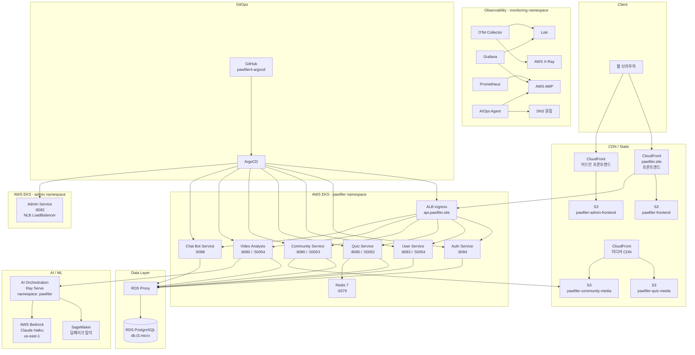
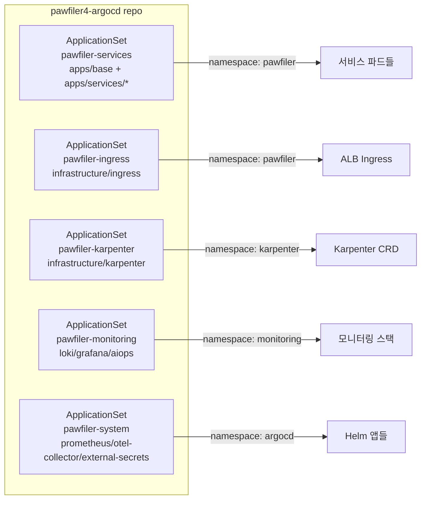
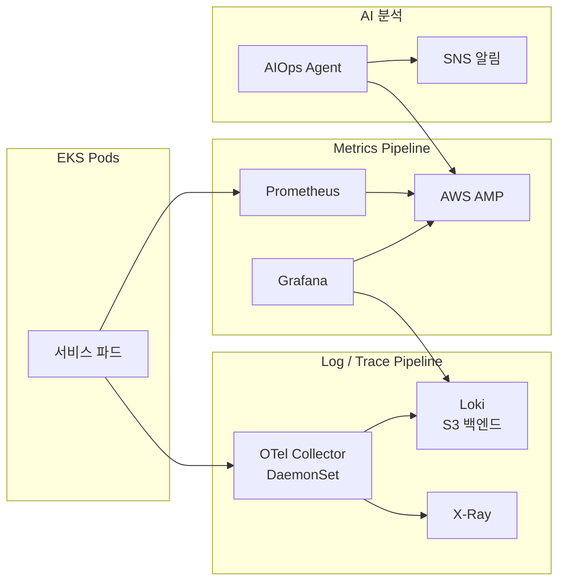

# PawFiler 시스템 아키텍처

## 전체 시스템 구조



---

## AWS 인프라 구조

```mermaid
graph TB
    subgraph "AWS ap-northeast-2"
        subgraph "VPC 10.0.0.0/16"
            subgraph "Public Subnet"
                ALB[ALB<br/>api.pawfiler.site]
                Bastion[Bastion Host<br/>t3.micro<br/>key: pawfiler]
                NLB[NLB<br/>admin-service]
            end

            subgraph "Private Subnet"
                subgraph "EKS Cluster"
                    NodeGroup[On-Demand Node Group<br/>t3.medium]
                    Karpenter[Karpenter<br/>Spot 자동 프로비저닝]
                end
                RDSProxy[RDS Proxy]
                RDS[(RDS PostgreSQL<br/>db.t3.micro)]
                Lambda[Lambda<br/>pawfiler-report]
            end
        end

        subgraph "Storage"
            S3_FE[S3 pawfiler-frontend]
            S3_ADMIN[S3 pawfiler-admin-frontend]
            S3_QUIZ[S3 pawfiler-quiz-media]
            S3_COMMUNITY[S3 pawfiler-community-media]
            S3_LOKI[S3 pawfiler-loki-chunks]
            S3_VIDEOS[S3 pawfiler-videos]
        end

        subgraph "CDN"
            CF1[CloudFront<br/>pawfiler.site]
            CF2[CloudFront<br/>어드민]
            CF3[CloudFront<br/>미디어]
        end

        subgraph "AI / ML"
            SageMaker[SageMaker<br/>딥페이크 탐지]
            Bedrock[Bedrock<br/>us-east-1]
        end

        subgraph "Observability"
            AMP[AMP<br/>Prometheus 장기 저장]
            XRay[X-Ray]
            SNS[SNS pawfiler-aiops]
        end

        ECR[ECR<br/>컨테이너 레지스트리]
        SecretsManager[Secrets Manager<br/>DB / JWT 시크릿]
        Route53[Route53<br/>api.pawfiler.site]
    end

    Internet --> Route53 --> ALB
    Bastion -->|SSH 터널 + kubectl| EKS Cluster
    CF1 --> S3_FE
    CF1 --> ALB
    CF2 --> S3_ADMIN
    CF3 --> S3_QUIZ
    CF3 --> S3_COMMUNITY
```

---

## 서비스별 상세

### API 라우팅 (ALB Ingress)

| Path | Service | Port |
|------|---------|------|
| `/api/auth` | auth-service | 8084 |
| `/api/user.UserService` | user-service | 8083 |
| `/api/quiz.QuizService` | quiz-service | 8080 |
| `/api/community.CommunityService` | community-service | 8080 |
| `/api/video_analysis.VideoAnalysisService` | video-analysis | 8080 |
| `/api/upload-video` | video-analysis | 8080 |
| `/api/chat` | chat-bot-service | 8088 |

> gRPC-Web 사용. 각 서비스는 HTTP(:8080/8083/8084/8088) + gRPC(:50052~50054) 듀얼 포트.

### 서비스 목록

| 서비스 | 언어 | Namespace | 포트 | 상태 |
|--------|------|-----------|------|------|
| auth-service | Go | pawfiler | 8084 | ✅ |
| user-service | Go | pawfiler | 8083 / 50054 | ✅ |
| quiz-service | Go | pawfiler | 8080 / 50052 | ✅ |
| community-service | Go | pawfiler | 8080 / 50053 | ✅ |
| video-analysis | Python | pawfiler | 8080 / 50054 | ✅ |
| chat-bot-service | Python | pawfiler | 8088 | ✅ |
| admin-service | Go | admin | 8082 (NLB) | ✅ (개발용 공개) |
| ai-orchestration | Python | pawfiler | Ray Serve (GPU) | ✅ |
| redis | - | pawfiler | 6379 (ClusterIP) | ✅ (emptyDir, 재시작 시 초기화) |

---

## GitOps 구조 (ArgoCD)



**시크릿 관리**: External Secrets Operator → AWS Secrets Manager

---

## 옵저버빌리티 스택



> 현재 비용 절감을 위해 replicas=0 (Prometheus, Grafana, Loki, AIOps). 재개 시 각 yaml에서 replicas 수정.

---

## 어드민 접근 방법

admin-service는 현재 NLB로 공개 노출 (개발 단계). 추후 Bastion SSH 터널로 전환 예정.

**현재 (개발)**:
```
브라우저 → NLB → admin-service:8082
```

**추후 (운영)**:
```bash
# bastion에서
kubectl port-forward svc/admin-service 8082:80 -n admin

# 로컬에서
ssh -i pawfiler.pem -L 8082:localhost:8082 ec2-user@<bastion-ip> -N
# 브라우저: http://localhost:8082
```

---

## IaC 구조 (Terraform)

| 모듈 | 역할 |
|------|------|
| networking | VPC, Subnet, IGW, Route Table |
| iam | EKS Cluster/Node IAM Role |
| eks | EKS Cluster, Node Group, OIDC, EBS CSI, Access Entry |
| bastion | Bastion EC2, IAM Role, SG, EKS Access Entry |
| rds | RDS PostgreSQL, RDS Proxy, SG |
| s3 | S3 버킷 + CloudFront 배포 |
| ecr | ECR 레포지토리 |
| helm | ALB Controller, ArgoCD, Karpenter, External Secrets, Metrics Server |
| irsa | 서비스별 IRSA IAM Role |
| karpenter | Karpenter IAM, SQS, EventBridge |
| lambda_report | Lambda + SQS + S3 (EDA 리포트) |

---

## 기술 스택

| Layer | Technology |
|-------|-----------|
| Frontend | React, TypeScript, Vite, TailwindCSS, Shadcn UI |
| Backend | Go (auth/user/quiz/community/admin), Python (video/chatbot/ai-orchestration) |
| Protocol | gRPC-Web + HTTP |
| Database | PostgreSQL 16 (RDS), Redis (EKS 파드) |
| ML | AWS SageMaker (딥페이크), AWS Bedrock Claude Haiku (AI Orchestration) |
| Container | Docker, ECR |
| Orchestration | EKS 1.31, Karpenter |
| IaC | Terraform |
| GitOps | ArgoCD + ApplicationSet |
| Observability | Prometheus, Grafana, Loki, OTel Collector, AMP, X-Ray |
| Secret | AWS Secrets Manager + External Secrets Operator |
| CDN | CloudFront (프론트엔드 + 미디어) |
