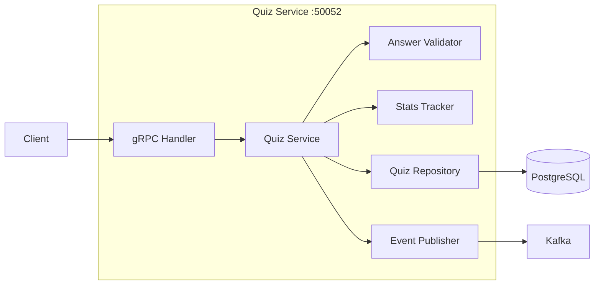
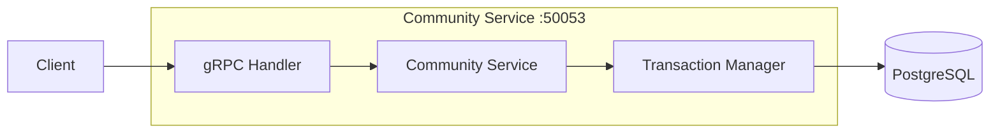
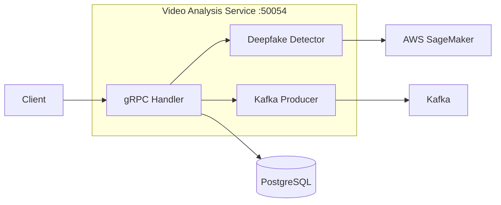
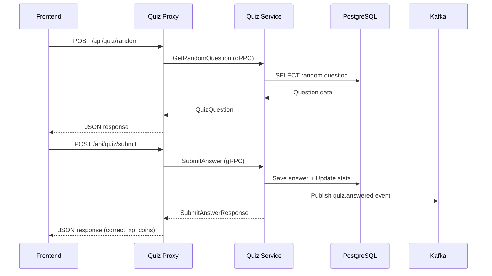
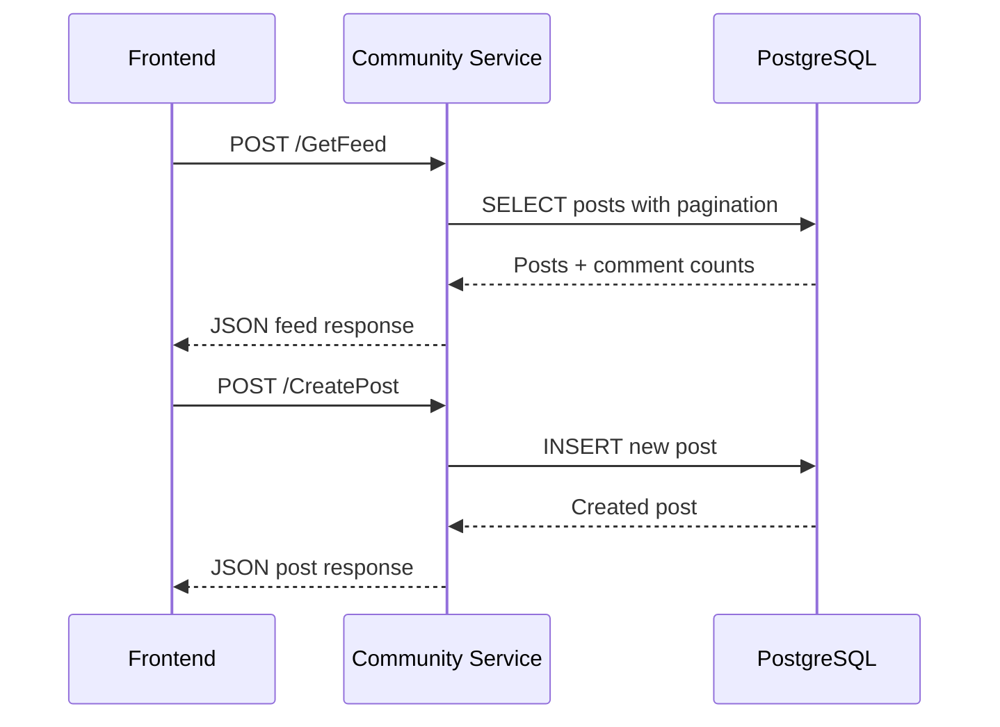
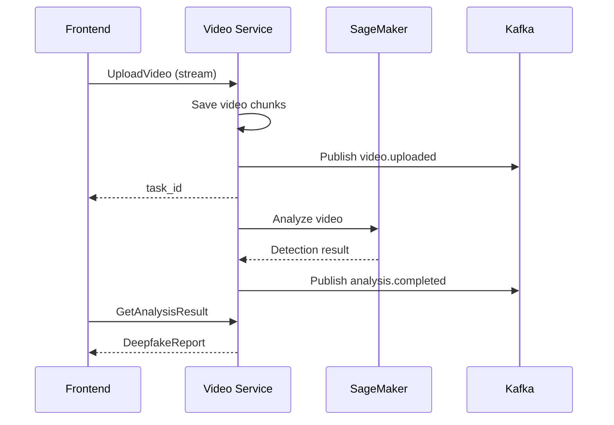
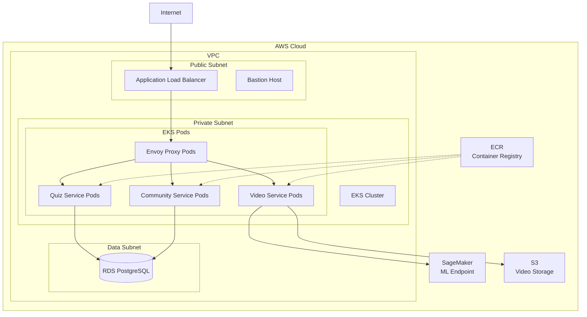
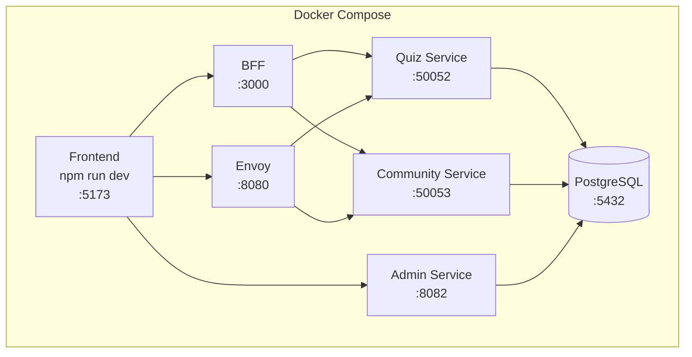

# PawFiler 시스템 아키텍처

## 전체 시스템 구조

```mermaid
graph TB
    subgraph "Frontend Layer"
        Browser[웹 브라우저]
        React[React SPA<br/>Vite + TypeScript]
    end

    subgraph "API Gateway Layer"
        Envoy[Envoy Proxy<br/>:8080<br/>gRPC-Web]
        BFF[BFF (Backend for Frontend)<br/>:3000<br/>gRPC → REST]
    end

    subgraph "Backend Services"
        QuizService[Quiz Service<br/>:50052<br/>Go + gRPC]
        CommunityService[Community Service<br/>:50053<br/>Go + REST]
        VideoService[Video Analysis Service<br/>:50054<br/>Python + gRPC]
        AuthService[Auth Service<br/>미구현]
        PaymentService[Payment Service<br/>미구현]
    end

    subgraph "Data Layer"
        PostgreSQL[(PostgreSQL<br/>:5432)]
        Redis[(Redis<br/>캐싱<br/>미구현)]
    end

    subgraph "Message Queue"
        Kafka[Apache Kafka<br/>이벤트 스트림]
    end

    subgraph "External Services"
        SageMaker[AWS SageMaker<br/>딥페이크 탐지 모델]
    end

    Browser --> React
    React --> BFF
    React --> Envoy
    
    BFF --> QuizService
    BFF --> CommunityService
    Envoy --> QuizService
    Envoy --> CommunityService
    Envoy --> VideoService
    
    QuizService --> PostgreSQL
    CommunityService --> PostgreSQL
    VideoService --> Kafka
    VideoService --> SageMaker
    
    QuizService --> Kafka
    
    style AuthService fill:#ddd,stroke:#999,stroke-dasharray: 5 5
    style PaymentService fill:#ddd,stroke:#999,stroke-dasharray: 5 5
    style Redis fill:#ddd,stroke:#999,stroke-dasharray: 5 5
```

## 서비스별 상세 아키텍처

### 1. Quiz Service (퀴즈 서비스)



**기능**:
- 4가지 퀴즈 타입 (객관식, OX, 영역선택, 비교)
- 답변 검증 및 보상 계산
- 사용자 통계 추적 (정답률, 연속 정답, 생명)
- Kafka 이벤트 발행

**기술 스택**: Go, gRPC, PostgreSQL, Kafka

**상태**: ✅ 구현 완료 (테스트 미완)

---

### 2. Community Service (커뮤니티 서비스)



**기능**:
- 게시글 CRUD (생성, 조회, 수정, 삭제)
- 댓글 작성/삭제
- 좋아요/좋아요 취소
- 검색 (제목, 본문, 태그)
- 페이지네이션
- 공지사항 조회
- 탐정 랭킹 (월간 좋아요 수)
- 인기 토픽 (일간 태그 통계)

**기술 스택**: Go, gRPC, PostgreSQL

**상태**: ✅ 완전 구현 (DB 연동, 트랜잭션 처리 완료)

---

### 3. Video Analysis Service (영상 분석 서비스)



**기능**:
- 영상 스트리밍 업로드
- 비동기 딥페이크 분석
- 분석 상태 추적 (로그)
- 결과 리포트 생성
- Kafka 이벤트 발행

**기술 스택**: Python, gRPC, Kafka, AWS SageMaker, PostgreSQL

**상태**: ✅ 구현 완료 (Docker Compose 등록됨, 프론트엔드는 Mock API 사용 중)

**참고**: 
- DB 스키마: `video_analysis.tasks`, `video_analysis.results`
- 프론트엔드는 현재 Mock API 사용 (`VITE_USE_MOCK_API=true`)
- 실제 연동을 위해서는 Envoy 설정 및 프론트엔드 API 호출 수정 필요

---

## 데이터 흐름

### Quiz 플로우



### Community 플로우



### Video Analysis 플로우



---

## 데이터베이스 스키마

### Quiz Schema

```sql
quiz.questions
├── id (PK)
├── type (multiple_choice, true_false, region_select, comparison)
├── media_type (video, image)
├── media_url
├── thumbnail_emoji
├── difficulty (easy, medium, hard)
├── category
├── explanation
├── options (JSONB)
├── correct_index
├── correct_answer (boolean)
├── correct_regions (JSONB)
├── tolerance
├── comparison_media_url
└── correct_side

quiz.user_answers
├── id (PK)
├── user_id (FK)
├── question_id (FK)
├── answer_data (JSONB)
├── is_correct
├── xp_earned
├── coins_earned
└── answered_at

quiz.user_stats
├── user_id (PK)
├── total_answered
├── correct_count
├── current_streak
├── best_streak
└── lives
```

### Community Schema

```sql
community.posts
├── id (PK)
├── user_id
├── author_nickname
├── author_emoji
├── title
├── body
├── tags (JSONB)
├── likes
├── created_at
└── updated_at

community.comments
├── id (PK)
├── post_id (FK)
├── user_id
├── author_nickname
├── author_emoji
├── body
└── created_at

community.post_likes
├── post_id (FK)
├── user_id
└── created_at
```

---

## 배포 아키텍처 (AWS)



**인프라 구성**:
- **EKS**: Kubernetes 클러스터 (서비스 오케스트레이션)
- **RDS**: PostgreSQL 관리형 데이터베이스
- **ECR**: Docker 이미지 저장소
- **ALB**: 로드 밸런서
- **SageMaker**: 딥페이크 탐지 ML 모델
- **S3**: 영상 파일 저장소
- **Bastion**: SSH 접근용 호스트

---

## 로컬 개발 환경



**실행 명령어**:
```bash
# Backend 시작
cd backend
docker-compose up -d

# Frontend 시작 (루트 디렉토리에서)
cd frontend
npm run dev

# Admin Frontend 시작
cd admin-frontend
npm run dev
```

---

## 기술 스택 요약

| Layer | Technology |
|-------|-----------|
| **Frontend** | React, TypeScript, Vite, TailwindCSS, Shadcn UI |
| **API Gateway** | Envoy Proxy, Node.js BFF (Backend for Frontend) |
| **Backend** | Go (Quiz, Community, Admin), Python (Video Analysis) |
| **Protocol** | gRPC, REST API, gRPC-Web |
| **Database** | PostgreSQL 16 |
| **Message Queue** | Apache Kafka (미사용) |
| **ML Platform** | AWS SageMaker (준비됨) |
| **Container** | Docker, Docker Compose |
| **Orchestration** | Kubernetes (EKS) |
| **IaC** | Terraform |

---

## 현재 구현 상태

| 서비스 | 구현 | DB 연결 | 테스트 | Docker | 프론트 연동 |
|--------|------|---------|--------|--------|------------|
| Quiz Service | ✅ | ✅ | ⚠️ | ✅ | ✅ |
| Community Service | ✅ | ✅ | ❌ | ✅ | ✅ |
| Admin Service | ✅ | ✅ | ❌ | ✅ | ✅ |
| Video Analysis | ✅ | ✅ | ❌ | ✅ | ⚠️ (Mock) |
| Auth Service | ❌ | ✅ (스키마) | ❌ | ❌ | ⚠️ (Mock) |
| Payment Service | ❌ | ✅ (스키마) | ❌ | ❌ | ⚠️ (Mock) |

**범례**:
- ✅ 완료
- ⚠️ 부분 완료 (기능은 있으나 실제 연동 안됨)
- ❌ 미구현

---

## 서비스별 상세 구현 상태

### ✅ Quiz Service (완전 구현)
- gRPC 서버 구현 완료
- 4가지 퀴즈 타입 지원
- 답변 검증 및 보상 계산
- 사용자 통계 추적
- Kafka 이벤트 발행
- PostgreSQL 완전 연동
- Docker Compose 등록
- 프론트엔드 연동 완료

### ✅ Community Service (완전 구현)
- gRPC 서버 구현 완료
- 게시글/댓글/좋아요 CRUD
- 트랜잭션 처리 완료
- 검색 및 페이지네이션
- 대시보드 API (공지, 랭킹, 인기 토픽)
- PostgreSQL 완전 연동
- Docker Compose 등록
- 프론트엔드 연동 완료

### ✅ Admin Service (완전 구현)
- REST API 서버 (gRPC 아님)
- 퀴즈 문제 CRUD
- S3 미디어 업로드
- PostgreSQL 연동
- Docker Compose 등록
- 관리자 프론트엔드 연동 완료

### ⚠️ Video Analysis Service (부분 구현)
- gRPC 서버 구현 완료
- 스트리밍 업로드 지원
- 비동기 분석 처리
- Kafka 이벤트 발행
- PostgreSQL 스키마 준비됨
- Docker Compose 등록됨
- **미완성**: 프론트엔드가 Mock API 사용 중 (실제 연동 필요)

### ❌ Auth Service (미구현)
- DB 스키마만 준비됨
- 프론트엔드는 Mock 인증 사용 (`localStorage` 기반)
- 실제 JWT 인증 시스템 구현 필요

### ❌ Payment Service (미구현)
- DB 스키마만 준비됨
- 프론트엔드는 Mock 결제 사용
- 실제 결제 게이트웨이 연동 필요

---

## 주요 이슈 및 개선 사항

### 🚨 Critical
1. **Quiz Handler 보안**: 정답 인덱스를 explanation에 숨겨서 보내는 방식 개선 필요
2. **Video Analysis Docker 등록**: Docker Compose에 video-analysis 서비스 추가 필요
3. **Video Analysis 프론트엔드 연동**: Mock API에서 실제 gRPC 연동으로 전환 필요
4. **Auth Service 구현**: 실제 JWT 기반 인증 시스템 구현 필요

### ⚠️ Important
1. **Community Service 검색 최적화**: ILIKE 대신 Full-text search 또는 GIN 인덱스 사용
2. **테스트**: 모든 서비스에 유닛/통합 테스트 추가
3. **모니터링**: 로깅, 메트릭, 트레이싱 시스템 추가
4. **gRPC Health Check**: 모든 gRPC 서비스에 health check 엔드포인트 추가
5. **Kafka 통합**: 현재 코드에 있지만 실제로 사용되지 않음

### 💡 Enhancement
1. **Redis**: 캐싱 레이어 추가 (퀴즈 문제, 사용자 통계)
2. **Rate Limiting**: API 호출 제한
3. **CDN**: S3 미디어 파일 CloudFront 배포
4. **CI/CD**: GitHub Actions 자동화 파이프라인
5. **Admin Service gRPC 전환**: REST API를 gRPC로 통일 (선택사항)
