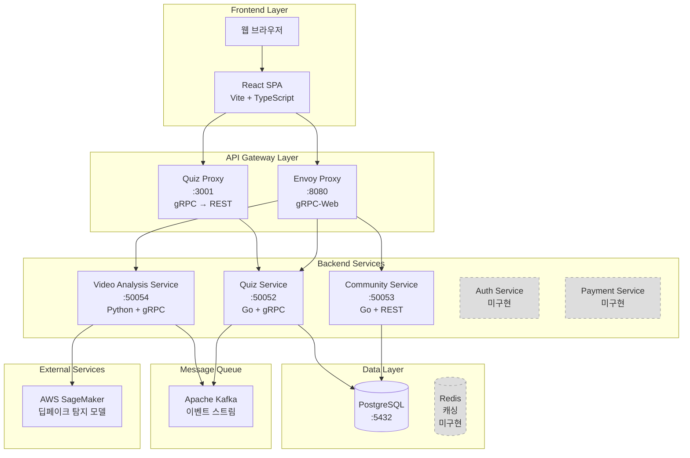
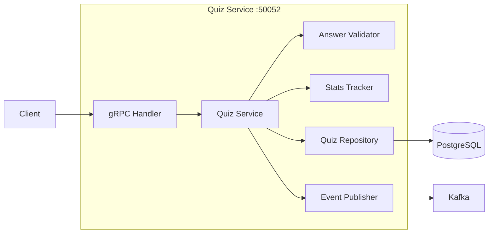
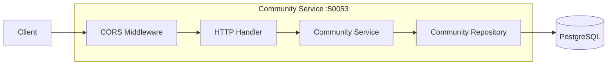
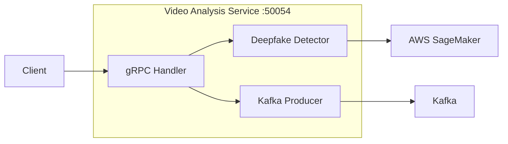
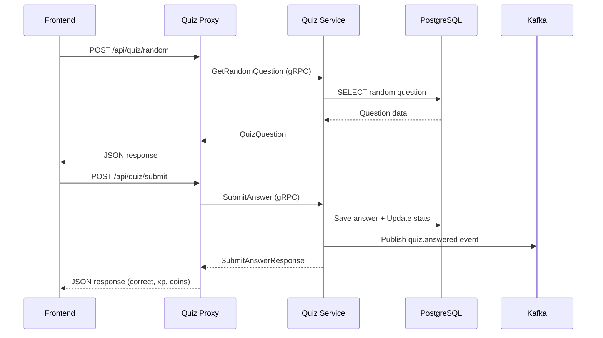
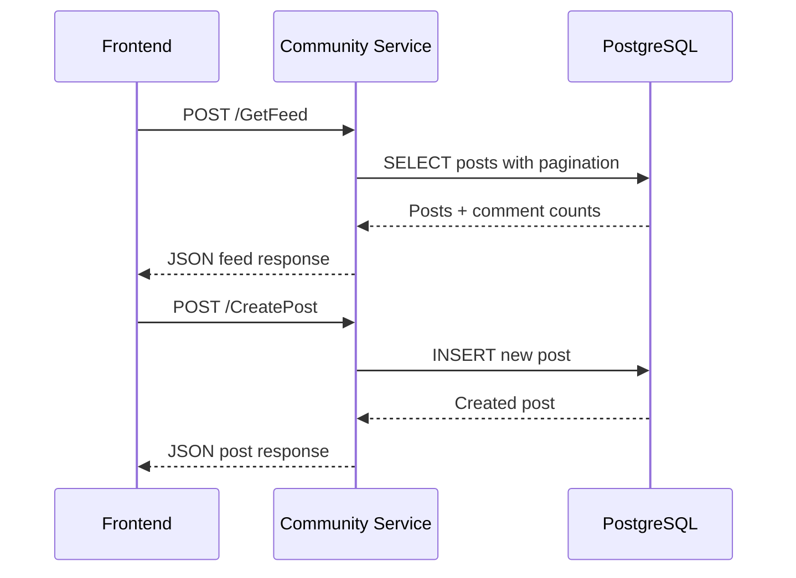
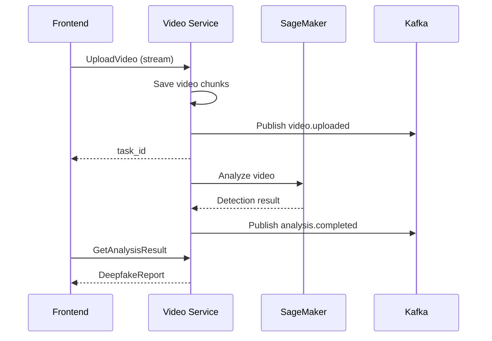
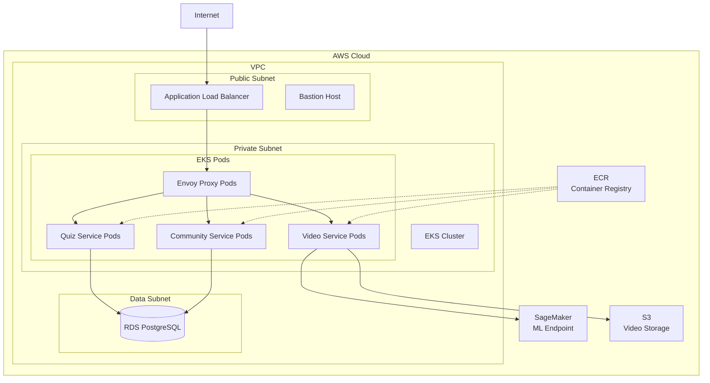
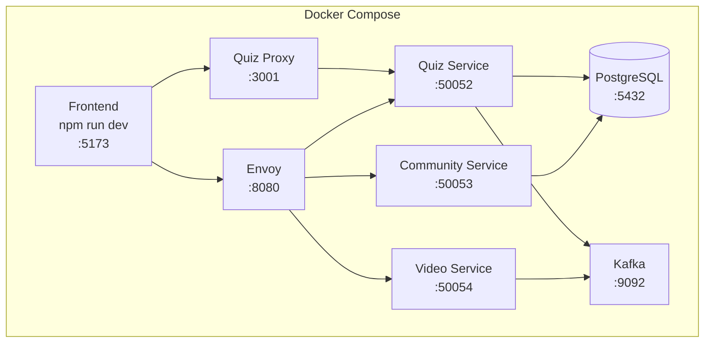

# PawFiler 시스템 아키텍처

## 전체 시스템 구조



## 서비스별 상세 아키텍처

### 1. Quiz Service (퀴즈 서비스)



**기능**:
- 4가지 퀴즈 타입 (객관식, OX, 영역선택, 비교)
- 답변 검증 및 보상 계산
- 사용자 통계 추적 (정답률, 연속 정답, 생명)
- Kafka 이벤트 발행

**기술 스택**: Go, gRPC, PostgreSQL, Kafka

**상태**: ✅ 구현 완료 (테스트 미완)

---

### 2. Community Service (커뮤니티 서비스)



**기능**:
- 게시글 CRUD
- 댓글 작성/삭제
- 좋아요 기능
- 태그/사용자별 필터링
- 페이지네이션

**기술 스택**: Go, REST API, PostgreSQL

**상태**: ⚠️ 부분 구현 (인메모리, DB 연동 필요)

---

### 3. Video Analysis Service (영상 분석 서비스)



**기능**:
- 영상 업로드 및 분석
- 딥페이크 탐지 (SageMaker 연동)
- 분석 상태 추적
- 결과 리포트 생성

**기술 스택**: Python, gRPC, Kafka, AWS SageMaker

**상태**: ⚠️ 구현됨 (Docker Compose 미등록, 프론트엔드 미연결)

---

## 데이터 흐름

### Quiz 플로우



### Community 플로우



### Video Analysis 플로우



---

## 데이터베이스 스키마

### Quiz Schema

```sql
quiz.questions
├── id (PK)
├── type (multiple_choice, true_false, region_select, comparison)
├── media_type (video, image)
├── media_url
├── thumbnail_emoji
├── difficulty (easy, medium, hard)
├── category
├── explanation
├── options (JSONB)
├── correct_index
├── correct_answer (boolean)
├── correct_regions (JSONB)
├── tolerance
├── comparison_media_url
└── correct_side

quiz.user_answers
├── id (PK)
├── user_id (FK)
├── question_id (FK)
├── answer_data (JSONB)
├── is_correct
├── xp_earned
├── coins_earned
└── answered_at

quiz.user_stats
├── user_id (PK)
├── total_answered
├── correct_count
├── current_streak
├── best_streak
└── lives
```

### Community Schema

```sql
community.posts
├── id (PK)
├── user_id
├── author_nickname
├── author_emoji
├── title
├── body
├── tags (JSONB)
├── likes
├── created_at
└── updated_at

community.comments
├── id (PK)
├── post_id (FK)
├── user_id
├── author_nickname
├── author_emoji
├── body
└── created_at

community.post_likes
├── post_id (FK)
├── user_id
└── created_at
```

---

## 배포 아키텍처 (AWS)



**인프라 구성**:
- **EKS**: Kubernetes 클러스터 (서비스 오케스트레이션)
- **RDS**: PostgreSQL 관리형 데이터베이스
- **ECR**: Docker 이미지 저장소
- **ALB**: 로드 밸런서
- **SageMaker**: 딥페이크 탐지 ML 모델
- **S3**: 영상 파일 저장소
- **Bastion**: SSH 접근용 호스트

---

## 로컬 개발 환경



**실행 명령어**:
```bash
# Backend 시작
cd backend
docker-compose up -d

# Frontend 시작
npm run dev
```

---

## 기술 스택 요약

| Layer | Technology |
|-------|-----------|
| **Frontend** | React, TypeScript, Vite, TailwindCSS, Shadcn UI |
| **API Gateway** | Envoy Proxy, Node.js (Quiz Proxy) |
| **Backend** | Go (Quiz, Community), Python (Video Analysis) |
| **Protocol** | gRPC, REST API, gRPC-Web |
| **Database** | PostgreSQL 15+ |
| **Message Queue** | Apache Kafka |
| **ML Platform** | AWS SageMaker |
| **Container** | Docker, Docker Compose |
| **Orchestration** | Kubernetes (EKS) |
| **IaC** | Terraform |

---

## 현재 구현 상태

| 서비스 | 구현 | DB 연결 | 테스트 | Docker | 프론트 연동 |
|--------|------|---------|--------|--------|------------|
| Quiz Service | ✅ | ✅ | ⚠️ | ✅ | ✅ |
| Community Service | ⚠️ | ❌ | ❌ | ✅ | ✅ |
| Video Analysis | ✅ | N/A | ❌ | ❌ | ❌ |
| Auth Service | ❌ | ❌ | ❌ | ❌ | ⚠️ (Mock) |
| Payment Service | ❌ | ❌ | ❌ | ❌ | ⚠️ (Mock) |

**범례**:
- ✅ 완료
- ⚠️ 부분 완료
- ❌ 미구현

---

## 주요 이슈 및 개선 사항

### 🚨 Critical
1. **Community Service**: PostgreSQL 연동 필요 (현재 인메모리)
2. **Video Analysis**: Docker Compose에 추가 필요
3. **Video Analysis**: 프론트엔드 연동 경로 구성 필요

### ⚠️ Important
1. **Auth Service**: 실제 인증 시스템 구현 필요 (현재 클라이언트 UUID)
2. **Payment Service**: 결제 시스템 구현 필요
3. **테스트**: 모든 서비스에 유닛/통합 테스트 추가
4. **모니터링**: 로깅, 메트릭, 트레이싱 시스템 추가

### 💡 Enhancement
1. **Redis**: 캐싱 레이어 추가
2. **Rate Limiting**: API 호출 제한
3. **CDN**: 정적 파일 및 미디어 배포
4. **CI/CD**: 자동화된 빌드/배포 파이프라인
