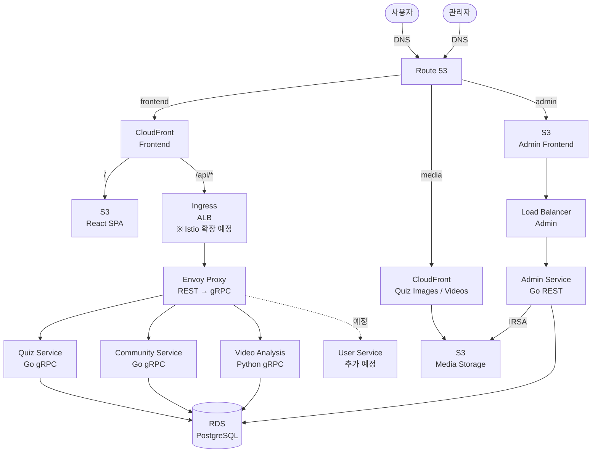

# PawFiler

딥페이크 탐지 교육 플랫폼

## 아키텍처



## 프로젝트 구조

```
pawfiler4/
├── frontend/              # 사용자 프론트엔드 (React + Vite)
├── admin-frontend/        # 관리자 프론트엔드 (React + Vite)
├── backend/services/
│   ├── quiz/             # 퀴즈 서비스 (Go + gRPC)
│   ├── community/        # 커뮤니티 서비스 (Go + gRPC)
│   ├── admin/            # 관리자 서비스 (Go + REST API)
│   └── video-analysis/   # 영상 분석 서비스 (Python + gRPC)
├── k8s/                  # Kubernetes 매니페스트
│   ├── envoy-proxy.yaml      # Envoy + gRPC-JSON transcoding
│   ├── envoy-ingress.yaml    # ALB Ingress
│   ├── proto-configmap.yaml  # Proto descriptor
│   └── admin/                # Admin service (IRSA)
├── terraform/            # AWS 인프라 (모듈화)
│   ├── infra.sh             # 통합 관리 스크립트
│   ├── main.tf              # 모듈 호출
│   └── modules/             # 인프라 모듈
│       ├── networking/      # VPC, Subnets
│       ├── eks/             # EKS Cluster
│       ├── rds/             # PostgreSQL
│       ├── helm/            # ArgoCD, Envoy, Kubecost
│       └── karpenter/       # Autoscaler (optional)
├── docs/                 # 문서
│   ├── KARPENTER.md
│   └── TROUBLESHOOTING-ALB.md
└── scripts/              # 배포 스크립트
```

## ⚠️ 보안 주의사항

**이 리포지토리는 공개되어 있습니다!**

절대 커밋하지 말 것:
- `terraform/terraform.tfvars` (gitignored)
- AWS Access Key/Secret Key
- 데이터베이스 비밀번호
- SSH 키 (*.pem, *.key)

자세한 내용: [terraform/README.md](terraform/README.md)

## 빠른 시작

### 1. 인프라 배포

```bash
cd terraform
terraform init
cp terraform.tfvars.example terraform.tfvars
# terraform.tfvars 수정 (database_password, bastion_key_name 등)

./infra.sh
# 1) 기본 인프라 생성 (VPC, IAM, ECR, S3, CloudFront)
# 2) EKS 시작
# 4) RDS 생성
```

### 2. K8s 배포

```bash
cd ../k8s

# DB Secret 설정 (실제 값으로 교체)
kubectl apply -f namespace.yaml
kubectl apply -f db-secret.yaml
kubectl apply -f admin/namespace.yaml
kubectl apply -f admin/db-secret.yaml

# 서비스 배포
kubectl apply -f quiz-service.yaml
kubectl apply -f community-service.yaml
kubectl apply -f admin/admin-service.yaml

# Envoy Proxy (gRPC-JSON transcoding)
kubectl apply -f proto-configmap.yaml
kubectl apply -f envoy-proxy.yaml
kubectl apply -f envoy-ingress.yaml

# ALB 도메인 확인
kubectl get ingress -n pawfiler envoy-ingress
```

### 3. CloudFront Origin 업데이트

```bash
cd ../terraform
# terraform.tfvars에 ALB 도메인 추가
# envoy_alb_domain = "k8s-pawfiler-envoying-xxx.elb.amazonaws.com"

./infra.sh
# 10) CloudFront Origin 업데이트
```

### 4. 프론트엔드 배포

```bash
cd ../frontend
npm run build
aws s3 sync dist/ s3://pawfiler-frontend --delete
aws cloudfront create-invalidation --distribution-id E1YU8EA9X822Q1 --paths "/*"
```

### AWS 배포

```bash
# 인프라 관리 (인터랙티브)
cd terraform
terraform init
./infra.sh

# 백엔드 서비스 빌드 및 푸시
./scripts/build-and-push.sh

# 프론트엔드 배포 (S3)
./scripts/deploy-frontend.sh
```

## 기술 스택

### Frontend
- React 18 + TypeScript
- Vite (빌드 도구)
- TailwindCSS + Shadcn UI
- React Router

### Backend
- **Quiz/Community Service**: Go + gRPC
- **Admin Service**: Go + REST API (IRSA for S3)
- **Video Analysis**: Python + gRPC (예정)

### Infrastructure
- **Compute**: AWS EKS (Kubernetes)
- **Database**: AWS RDS (PostgreSQL)
- **Storage**: S3 (Frontend, Media)
- **CDN**: CloudFront
- **Load Balancer**: ALB (Application Load Balancer)
- **API Gateway**: Envoy Proxy (gRPC-JSON transcoding)
- **Container Registry**: ECR
- **IaC**: Terraform
- **GitOps**: ArgoCD (Helm)
- **Monitoring**: 
  - Kubecost (비용 분석)
  - Grafana (리소스 대시보드)
  - Prometheus (메트릭 수집)

## 주요 기능

- ✅ gRPC-JSON Transcoding (Envoy)
- ✅ IRSA (IAM Roles for Service Accounts)
- ✅ CloudFront + S3 정적 호스팅
- ✅ ALB Ingress Controller
- ✅ Spot + On-Demand 혼합 노드 그룹
- ✅ Kubecost (비용 모니터링)
- ✅ ML Cascade 파이프라인 (비용 69% 절감)
- ✅ 음성 딥페이크 탐지 (Colab 무료 학습)

## 문서

### 필수
- [docs/DEPLOYMENT.md](./docs/DEPLOYMENT.md) - 배포 가이드 ⭐
- [docs/DEVELOPMENT.md](./docs/DEVELOPMENT.md) - 개발 가이드 ⭐
- [ARCHITECTURE.md](./ARCHITECTURE.md) - 시스템 아키텍처 ⭐

### 상세
- [terraform/README.md](./terraform/README.md) - Terraform 인프라 관리
- [k8s/README.md](./k8s/README.md) - Kubernetes 매니페스트

## 비용 관리

### 무료 ($0/월)
- VPC, IAM, ECR, S3, CloudFront (사용량 기반)

### 유료 (필요시)
- EKS: $133/월
- RDS: $15/월
- NAT Gateway: $32/월
- Bastion: $8/월
- **노드**: On-Demand 1개 + Spot 1개 (~$50/월)

### 비용 절감 팁
```bash
cd terraform
./infra.sh
# 3) EKS 중지
# 7) Bastion 중지
```

**Spot 인스턴스**: 약 70% 절감 (단, 중단 가능)

**모니터링 접속:**
```bash
# 비용 분석
kubectl port-forward -n monitoring svc/kubecost-cost-analyzer 9090:9090
# http://localhost:9090

# 리소스 대시보드
kubectl port-forward -n monitoring svc/grafana 3000:80
# http://localhost:3000 (admin/admin)
```

## 라이선스

MIT
