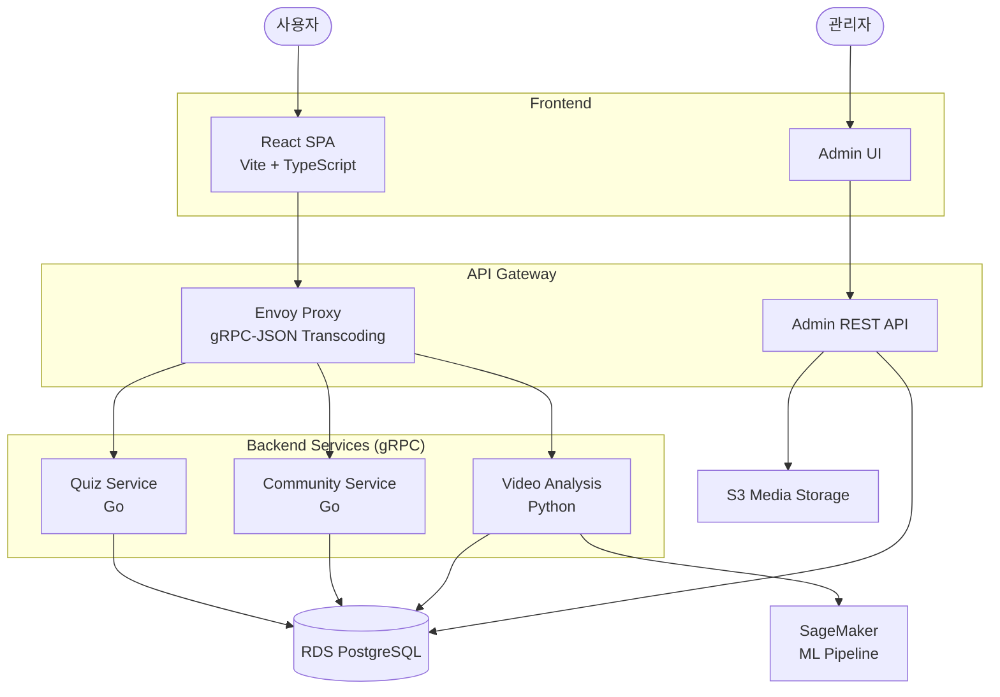

# PawFiler

AI 미디어 리터러시 교육 플랫폼

## 프로젝트 소개

PawFiler는 AI로 생성되거나 조작된 미디어(영상, 음성, 이미지)를 구별하는 방법을 가르치는 교육 플랫폼입니다.

**핵심 가치**: 사용자들이 AI로 생성/조작된 미디어를 스스로 판별할 수 있는 능력을 키우는 것

### 교육 카테고리
- 딥페이크 (얼굴 합성)
- AI 합성 영상 (생성형 AI)
- 음성 합성 (AI 보이스)
- 이미지 조작
- 기타 AI 생성 콘텐츠

## 아키텍처



## 프로젝트 구조

```
pawfiler4/
├── frontend/              # 사용자 프론트엔드 (React + Vite)
├── admin-frontend/        # 관리자 프론트엔드 (React + Vite)
├── backend/
│   ├── services/
│   │   ├── quiz/         # 퀴즈 서비스 (Go + gRPC)
│   │   ├── community/    # 커뮤니티 서비스 (Go + gRPC)
│   │   ├── admin/        # 관리자 서비스 (Go + REST)
│   │   └── video-analysis/ # 영상 분석 서비스 (Python + gRPC)
│   ├── proto/            # gRPC 프로토콜 정의
│   └── scripts/          # DB 초기화 스크립트
├── k8s/                  # Kubernetes 매니페스트
├── terraform/            # AWS 인프라 (IaC)
├── scripts/              # 배포 및 ML 학습 스크립트
└── docs/                 # 문서
```

## 빠른 시작

### 로컬 개발 환경

#### 1. Backend 시작

```bash
cd backend
docker-compose up -d
```

서비스 포트:
- PostgreSQL: `5432`
- Quiz Service: `50052`
- Community Service: `50053`
- Admin Service: `8082`
- Envoy Proxy: `8080`

#### 2. Frontend 시작

```bash
# 사용자 프론트엔드
cd frontend
npm install
npm run dev  # http://localhost:5173

# 관리자 프론트엔드
cd admin-frontend
npm install
npm run dev  # http://localhost:5174
```

### AWS 배포

#### 1. 인프라 배포

```bash
cd terraform
terraform init
cp terraform.tfvars.example terraform.tfvars
# terraform.tfvars 수정 (database_password, bastion_key_name 등)

./infra.sh
# 1) 기본 인프라 생성 (VPC, IAM, ECR, S3)
# 2) EKS 시작
# 4) RDS 생성
```

#### 2. 서비스 배포

```bash
# 백엔드 빌드 및 ECR 푸시
./scripts/build-and-push.sh

# Kubernetes 배포
cd k8s
kubectl apply -f namespace.yaml
kubectl apply -f db-secret.yaml
kubectl apply -f quiz-service.yaml
kubectl apply -f community-service.yaml
kubectl apply -f envoy-proxy.yaml
kubectl apply -f envoy-ingress.yaml

# 프론트엔드 배포 (S3)
./scripts/deploy-frontend.sh
```

## 주요 기능

### 1. Quiz Service (교육 콘텐츠)
- 4가지 퀴즈 타입: 객관식, OX, 영역선택, 비교
- 실시간 피드백 및 보상 시스템 (XP, 코인)
- 사용자 통계 추적 (정답률, 연속 정답, 생명)
- 성능 목표: p95 < 200ms

### 2. Video/Audio Analysis (실습 도구)
- 영상/음성 업로드 및 분석
- ML Cascade 파이프라인 (비용 69% 절감)
- 비동기 백그라운드 처리
- 성능 목표: 
  - Throughput: 최소 10 requests/minute
  - Latency: p95 < 30초, p99 < 60초

### 3. Community Service (학습 공유)
- 게시글/댓글/좋아요 CRUD
- 검색 및 페이지네이션
- 탐정 랭킹 (월간 좋아요 수)
- 인기 토픽 (일간 태그 통계)
- 성능 목표: p95 < 300ms

### 4. Admin Service
- 퀴즈 문제 관리 (CRUD)
- S3 미디어 업로드 (IRSA)
- 사용자 관리

## 기술 스택

### Frontend
- React 18 + TypeScript
- Vite (빌드 도구)
- TailwindCSS + Shadcn UI
- React Router

### Backend
- **Quiz/Community**: Go + gRPC
- **Admin**: Go + REST API (IRSA for S3)
- **Video Analysis**: Python + gRPC

### Infrastructure
- **Compute**: AWS EKS (Kubernetes)
- **Database**: AWS RDS (PostgreSQL 16)
- **Storage**: S3 (Frontend, Media)
- **API Gateway**: Envoy Proxy (gRPC-JSON transcoding)
- **ML Platform**: AWS SageMaker
- **Container Registry**: ECR
- **IaC**: Terraform
- **Monitoring**: Kubecost, Grafana, Prometheus

### ML/AI
- ML Cascade 파이프라인 (경량 → 중량 모델)
- 음성 딥페이크 탐지 (Colab 무료 학습)
- 비용 최적화: 69% 절감

## 구현 상태

| 서비스 | 구현 | DB 연결 | Docker | 프론트 연동 |
|--------|------|---------|--------|------------|
| Quiz Service | 완료 | 완료 | 완료 | 완료 |
| Community Service | 완료 | 완료 | 완료 | 완료 |
| Admin Service | 완료 | 완료 | 완료 | 완료 |
| Video Analysis | 완료 | 완료 | 완료 | 부분 (Mock) |
| Auth Service | 미구현 | 완료 (스키마) | 미구현 | 부분 (Mock) |

## 비용 관리

### 무료 ($0/월)
- VPC, IAM, ECR, S3 (사용량 기반)

### 유료 (필요시)
- **EKS**: $133/월
- **RDS**: $15/월 (db.t3.micro)
- **NAT Gateway**: $32/월
- **Bastion**: $8/월 (t3.micro)
- **노드**: On-Demand 1개 + Spot 1개 (~$50/월)

### 비용 절감
```bash
cd terraform
./infra.sh
# 3) EKS 중지
# 7) Bastion 중지
```

**Spot 인스턴스**: 약 70% 절감 (단, 중단 가능)

### 모니터링
```bash
# 비용 분석 (Kubecost)
kubectl port-forward -n monitoring svc/kubecost-cost-analyzer 9090:9090
# http://localhost:9090

# 리소스 대시보드 (Grafana)
kubectl port-forward -n monitoring svc/grafana 3000:80
# http://localhost:3000 (admin/admin)
```

## 문서

### 필수
- [ARCHITECTURE.md](./ARCHITECTURE.md) - 시스템 아키텍처
- [docs/DEPLOYMENT.md](./docs/DEPLOYMENT.md) - 배포 가이드
- [docs/DEVELOPMENT.md](./docs/DEVELOPMENT.md) - 개발 가이드

### 상세
- [terraform/README.md](./terraform/README.md) - Terraform 인프라 관리
- [k8s/README.md](./k8s/README.md) - Kubernetes 매니페스트
- [docs/ML_PROJECT_OVERVIEW.md](./docs/ML_PROJECT_OVERVIEW.md) - ML 파이프라인
- [docs/troubleshooting/](./docs/troubleshooting/) - 트러블슈팅

## 보안 주의사항

**이 리포지토리는 공개되어 있습니다!**

절대 커밋하지 말 것:
- `terraform/terraform.tfvars` (gitignored)
- AWS Access Key/Secret Key
- 데이터베이스 비밀번호
- SSH 키 (*.pem, *.key)

자세한 내용: [terraform/README.md](terraform/README.md)

## 주요 기술적 성과

- gRPC-JSON Transcoding (Envoy)
- IRSA (IAM Roles for Service Accounts)
- Spot + On-Demand 혼합 노드 그룹
- ML Cascade 파이프라인 (비용 69% 절감)
- 음성 딥페이크 탐지 (Colab 무료 학습)
- Kubecost 비용 모니터링

## 라이선스

MIT
